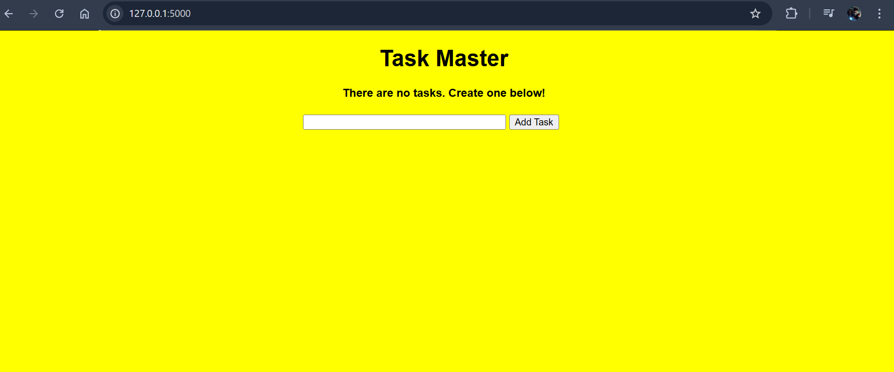
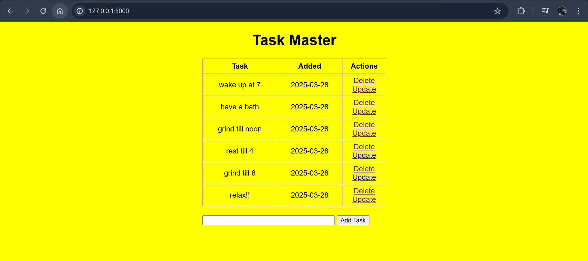

# Task Manager (TO-DO List) 📝

This is my first Flask project: a simple Task Manager website (TO-DO list) that runs locally.  
I built it by following a FreeCodeCamp YouTube tutorial by **Jake Rieger**.

---

## Features 🚀
- Add tasks to your to-do list.
- View all your saved tasks.
- Update or delete tasks as needed.
- Simple and effective design for easy task management.

---

## Screenshots 📷

### Home Page
Here’s what the home page looks like:  

### Adding Tasks
After adding all the required tasks:  

### Updating Tasks
If you wish to update tasks you’ve already uploaded:  

