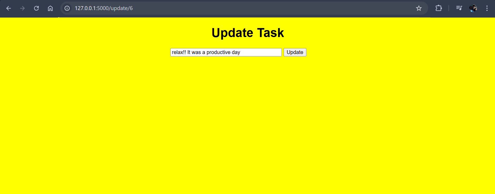

<b>TASK MANAGER</b>
 
This is my first Flask project: a simple Task Manager website (TO-DO list) that runs locally.
I built it by following a FreeCodeCamp YouTube tutorial by Jake Rieger.
 
I built it by following a FreeCodeCamp YouTube tutorial by Jake Rieger.
 

This is the home page
 

 
 
After you add all the required tasks
 

 
 
If you wish to update the tasks already uploaded
 

 
Simple, yet effective TO-DO list

# Task Manager (TO-DO List) 📝

This is my first Flask project: a simple Task Manager website (TO-DO list) that runs locally.  
I built it by following a FreeCodeCamp YouTube tutorial by **Jake Rieger**.

---

## Features 🚀
- Add tasks to your to-do list.
- View all your saved tasks.
- Update or delete tasks as needed.
- Simple and effective design for easy task management.

---

## Screenshots 📷

### Home Page
Here’s what the home page looks like:  

### Adding Tasks
After adding all the required tasks:  

### Updating Tasks
If you wish to update tasks you’ve already uploaded:  

